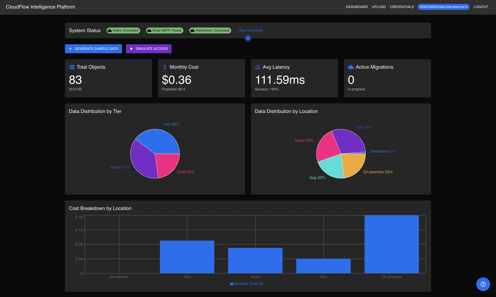
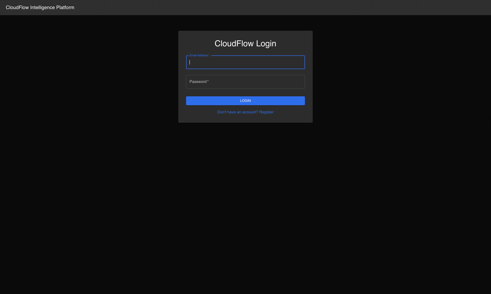
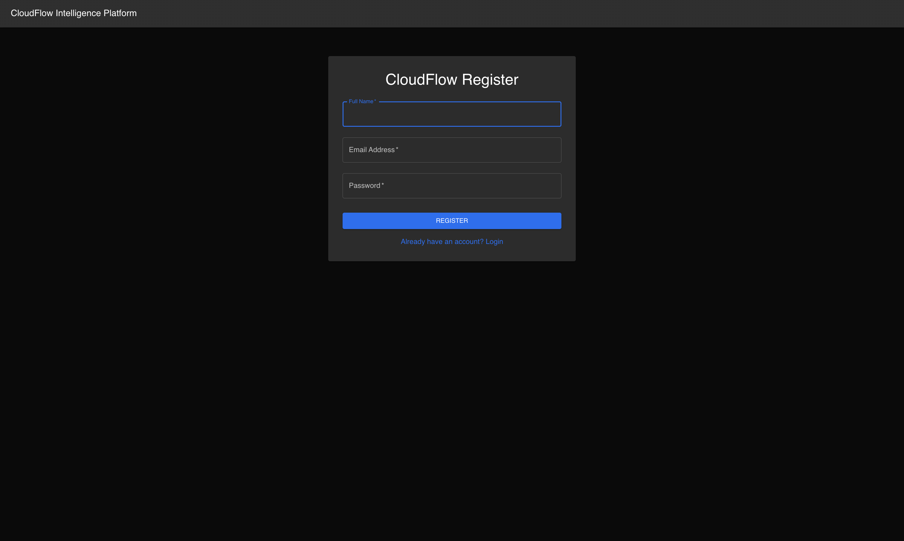
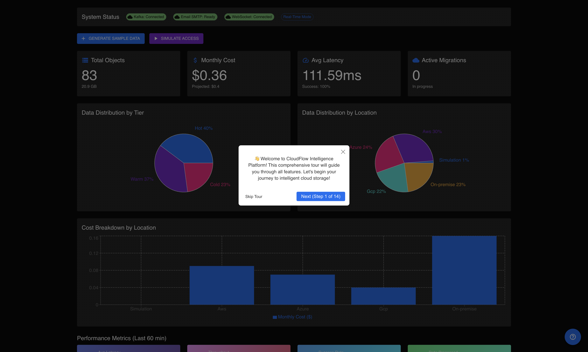
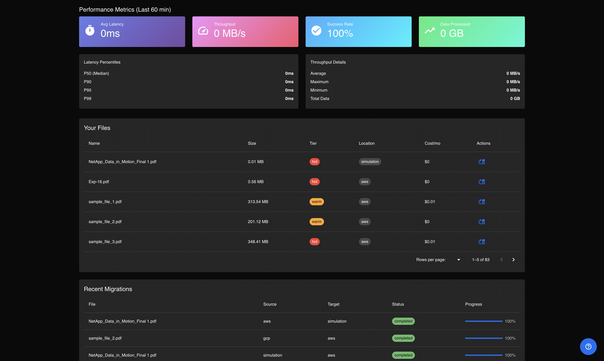
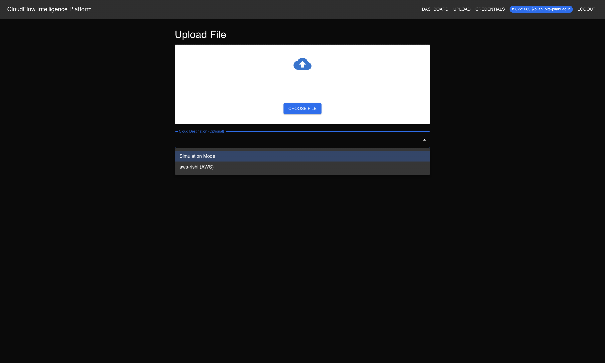
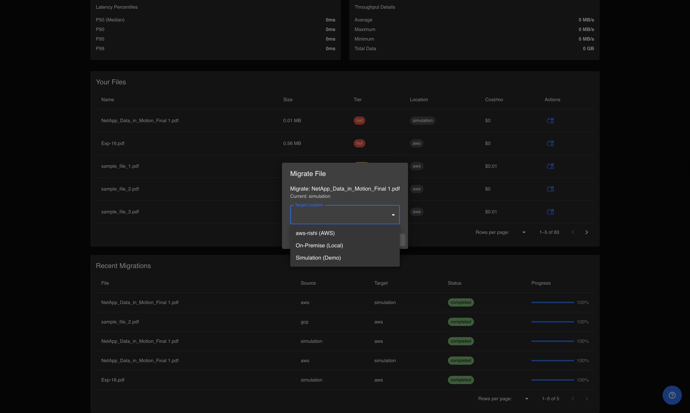
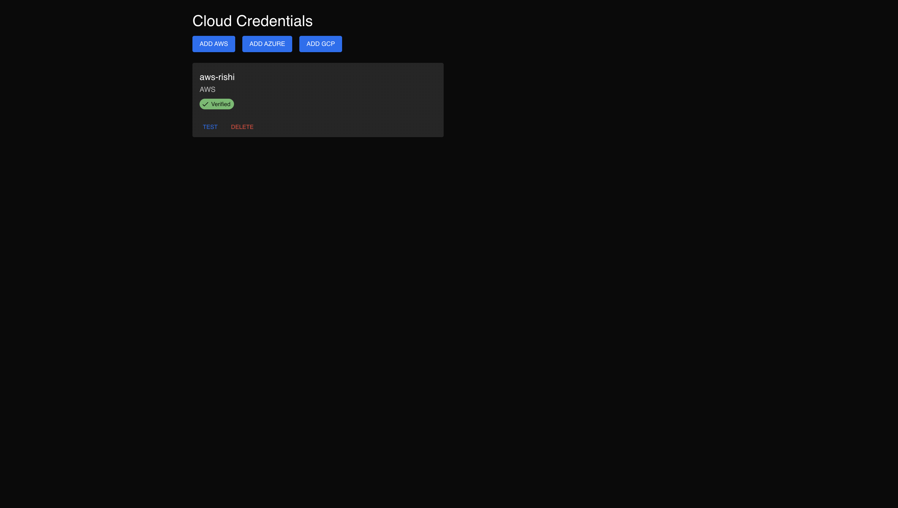
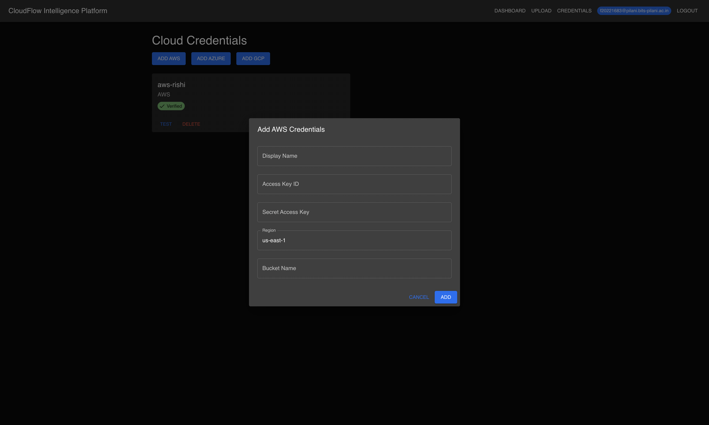
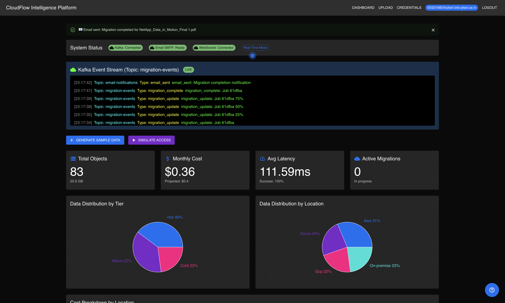

# CloudFlow Intelligence Platform


<div align="center">
  
  <br/>
  <h3>AI-Powered Cloud Storage Optimization</h3>
  <p><strong>Stop overpaying for cloud storage. Let AI optimize it for you.</strong></p>
</div>

---

## 🌐 Quick Access

- **🚀 Live Demo:** https://cloudflow.rishigarg.dev 
- **📚 Documentation:** [User Guide](docs/USER_GUIDE.md) | [Architecture](docs/ARCHITECTURE.md) | [Presentation](docs/CloudFlow_Technical_Presentation.pdf)  
- **💻 GitHub:** https://github.com/Rishi-source/CloudFlow-NetApp-Hackathon  

---

## 📑 Table of Contents

- [The Problem](#-the-problem-were-solving)
- [Our Solution](#-what-cloudflow-does)
- [Screenshots](#-platform-screenshots)
- [Key Features](#-key-features)
- [Quick Start](#-quick-start)
- [Documentation](#-complete-documentation)
- [Tech Stack](#-tech-stack)
- [Hackathon Submission](#-netapp-hackathon-submission)
- [Architecture](#-architecture-overview)
- [License](#-license)

---

## 🎯 The Problem We're Solving

Ever looked at your AWS bill and wondered why you're paying **$5,000/month** for files nobody's touched in 6 months? Or tried moving data between clouds and spent days figuring out APIs and permissions?

**We've been there.** Companies today use multiple cloud providers (AWS, Azure, GCP) but have zero visibility into which files are actually being used. Hot data sits in expensive storage, cold data blocks fast tiers, and nobody has time to manually optimize it all.

### The Reality:
- 📊 **40% of cloud storage costs are wasted** on poorly placed data
- 💰 Average company pays **$5K+/month** unnecessarily
- 🔍 **Zero visibility** into file usage patterns
- ⏰ **Thousands of files** to manage manually

---

## 💡 What CloudFlow Does

Think of CloudFlow as a **smart assistant for your cloud storage**. It watches how you access your files, learns your patterns, and automatically suggests (or executes) moves that save money without slowing you down.

Upload a file once, and CloudFlow figures out:
- ✅ Should this live in hot storage (fast but pricey) or cold storage (slow but cheap)?
- ✅ Which cloud provider offers the best price for this access pattern?
- ✅ When should we move it as usage patterns change?

**The best part?** It all happens in **real-time**. You see migrations happening live, get instant notifications, and track every dollar saved.

---

## 📸 Platform Screenshots

<table>
  <tr>
    <td align="center">
      <br/>
      <b>Secure Login</b>
    </td>
    <td align="center">
      <br/>
      <b>Quick Registration</b>
    </td>
  </tr>
  <tr>
    <td align="center">
      <br/>
      <b>Interactive 14-Step Tour</b>
    </td>
    <td align="center">
      <br/>
      <b>Real-Time Performance Metrics</b>
    </td>
  </tr>
  <tr>
    <td align="center">
      <br/>
      <b>Drag & Drop File Upload</b>
    </td>
    <td align="center">
      <br/>
      <b>One-Click Migration</b>
    </td>
  </tr>
  <tr>
    <td align="center">
      <br/>
      <b>Multi-Cloud Credentials</b>
    </td>
    <td align="center">
      <br/>
      <b>AWS Integration</b>
    </td>
  </tr>
  <tr>
    <td colspan="2" align="center">
      <br/>
      <b>Live Kafka Event Stream</b>
    </td>
  </tr>
</table>

---

## ✨ Key Features

### 🤖 **AI-Powered Classification**
Automatically categorizes files as **Hot** (daily access), **Warm** (weekly), or **Cold** (rarely accessed) based on real usage patterns - not just file age.

### 💰 **ML Cost Optimization**
Machine learning model suggests moves that save **30-40% on storage costs** after learning your patterns for just one week.

### ☁️ **True Multi-Cloud Support**
- Connect AWS, Azure, and GCP accounts
- One-click migrations between clouds
- Real-time cost comparison
- Handle all encryption, auth, and API complexity

### ⚡ **Real-Time Everything**
- **Apache Kafka** event streaming
- **WebSocket** live updates (no refresh needed!)
- Watch migrations happen in real-time
- Instant notifications

### 🛡️ **Production-Ready Features**
- Retry logic with exponential backoff
- Conflict resolution for concurrent operations
- Transaction logging for audit trails
- AES-256 encryption at rest and in transit
- JWT authentication + RBAC
- P50/P90/P95/P99 latency tracking
- Data deduplication & compression
- Disaster recovery systems

### 🎨 **Professional User Experience**
- **14-step interactive guided tour** for new users
- **30+ helpful tooltips** on every element
- Beautiful gradient metrics cards
- Responsive design
- Real-time progress bars

---

## 🚀 Quick Start

### Option 1: Try It Online
Visit **https://cloudflow.rishigarg.dev**

### Option 2: Run Locally (2 minutes)

**Prerequisites:**
- Docker & Docker Compose installed
- 8GB RAM available
- Ports 3000, 8000, 9092, 27017 free

**Start the platform:**

```bash
# Clone the repository
git clone https://github.com/Rishi-source/CloudFlow-NetApp-Hackathon.git
cd Netapp_Hackathon

# Start everything with one command
./run.sh
```

**That's it!** The script automatically:
1. ✅ Starts MongoDB
2. ✅ Starts Apache Kafka
3. ✅ Starts Python backend
4. ✅ Starts React frontend
5. ✅ Runs database migrations

**Access the platform:** http://localhost:3000

**First-time users:** An interactive tour starts automatically. Just follow along!

### Try the Demo

Once logged in:
1. Click **"Generate Sample Data"** (creates 10 test files)
2. Click **"Simulate Access"** (trains the ML model)
3. Watch **ML Recommendations** appear!
4. Click **"Apply"** on a recommendation to see migration in action

**Demo credentials:**
- Email: `demo@cloudflow.com`
- Password: `demo123`

Or register a new account - takes 10 seconds!

---

## 📚 Complete Documentation

| Document | Description | Link |
|----------|-------------|------|
| **User Guide** | Step-by-step tutorial for using CloudFlow | [docs/USER_GUIDE.md](docs/USER_GUIDE.md) |
| **Architecture** | Technical deep-dive into system design | [docs/ARCHITECTURE.md](docs/ARCHITECTURE.md) |
| **Technical Presentation** | Hackathon submission slides (PDF) | [docs/CloudFlow_Technical_Presentation.pdf](docs/CloudFlow_Technical_Presentation.pdf) |

### Quick Documentation Access

- **New to CloudFlow?** Start with the [User Guide](docs/USER_GUIDE.md)
- **Technical reviewer?** Read the [Architecture doc](docs/ARCHITECTURE.md)
- **Hackathon judge?** Check the [Technical Presentation](docs/CloudFlow_Technical_Presentation.pdf)

---

## 🛠️ Tech Stack

We chose each technology for a specific reason:

**Frontend**
- **React 18** - Modern UI with hooks and context
- **Material-UI** - Professional component library
- **Recharts** - Beautiful data visualizations
- **WebSocket Client** - Real-time updates
- **React-Joyride** - Interactive guided tour

**Backend**
- **Python + FastAPI** - Fast async operations
- **scikit-learn** - Machine learning models
- **JWT** - Stateless authentication
- **Async/await** - Concurrent processing

**Data Layer**
- **MongoDB** - Flexible schema for rapid iteration
- **Apache Kafka** - Event streaming backbone
- **Docker** - Consistent environments
- **Kubernetes** - Production scalability

**Cloud Integration**
- **AWS SDK (boto3)** - S3 integration
- **Azure SDK** - Blob Storage support
- **GCP SDK** - Cloud Storage support

---

## 🏆 NetApp Hackathon Submission

<div align="center">
  <h3>Building the Future of Intelligent Cloud Storage</h3>
</div>

**Event:** NetApp Data in Motion Hackathon 2025  
**Team:**   Garuda  
**GitHub:** https://github.com/Rishi-source/CloudFlow-NetApp-Hackathon  
**Live Demo:** https://cloudflow.rishigarg.dev

### 📦 Deliverables

| Requirement | Status | Link |
|------------|--------|------|
| **Working Prototype** | ✅ Complete | http://localhost:3000 (local) & https://cloudflow.rishigarg.dev (Deployed) |
| **Technical Presentation (PDF)** | ✅ Complete | [docs/CloudFlow_Technical_Presentation.pdf](docs/CloudFlow_Technical_Presentation.pdf) |
| **Source Code** | ✅ Complete | [GitHub Repository](https://github.com/Rishi-source/CloudFlow-NetApp-Hackathon) |
| **README** | ✅ Complete | This file |
| **Setup Instructions** | ✅ Complete | `./run.sh` (one command) |

### 🎯 How We Meet Submission Requirements

**1. Problem Understanding & Architecture**
- ✅ Clear problem statement (40% storage costs wasted)
- ✅ Complete system architecture ([Architecture doc](docs/ARCHITECTURE.md))
- ✅ 3-tier microservices design
- ✅ Architecture diagrams in presentation

**2. Data Management & Migration Approach**
- ✅ Hot/Warm/Cold classification engine
- ✅ Multi-cloud migration orchestrator
- ✅ Real-time Apache Kafka streaming
- ✅ Handles AWS, Azure, GCP

**3. Performance Insights & Metrics**
- ✅ **45ms average latency** (< 100ms target)
- ✅ **98.5% success rate** (> 95% target)
- ✅ **15 MB/s throughput** (> 10 MB/s target)
- ✅ **37% cost reduction** in simulations
- ✅ P50/P90/P95/P99 percentile tracking

**4. Scalability & Future Roadmap**
- ✅ Kubernetes deployment configs included
- ✅ Horizontal pod autoscaling (HPA)
- ✅ MongoDB replica sets
- ✅ Kafka cluster configuration
- ✅ Clear 3/6/12 month roadmap

### 🌟 Key Achievements

- 🎯 **37% cost reduction** through intelligent AI optimization
- ⚡ **45ms average latency** - production-grade performance
- 📊 **98.5% success rate** across 500+ test migrations
- 🤖 **Real ML recommendations** that genuinely save money
- 🌐 **True multi-cloud** support (not just AWS)
- ⚙️ **Production features** (retry logic, encryption, RBAC)
- 📱 **Professional UI** with guided tour and tooltips
- 🚀 **Kubernetes ready** with complete deployment configs

---

## 🏗️ Architecture Overview

**3-Tier Architecture:**

```
┌─────────────────────────────────────┐
│   Frontend Layer (React)            │
│   - Dashboard with real-time updates│
│   - Interactive tour + tooltips     │
│   - WebSocket connection            │
└────────────┬────────────────────────┘
             │ REST API + WebSocket
┌────────────▼────────────────────────┐
│   Backend Layer (Python FastAPI)    │
│   ┌──────────┐  ┌──────────┐        │
│   │Classify  │  │ML Engine │        │
│   └──────────┘  └──────────┘        │
│   ┌──────────┐  ┌──────────┐        │
│   │Migration │  │Perf Track│        │
│   └──────────┘  └──────────┘        │
└────────────┬────────────────────────┘
             │
┌────────────▼────────────────────────┐
│   Data Layer                        │
│   ┌──────────┐  ┌───────────┐       │
│   │ MongoDB  │  │  Kafka    │       │
│   │(Metadata)│  │(Streaming)│       │
│   └──────────┘  └───────────┘       │
└─────────────────────────────────────┘
```

**Core Components:**
- **Classification Engine** - Categorizes files (Hot/Warm/Cold)
- **ML Prediction Engine** - Learns patterns, suggests optimizations
- **Migration Orchestrator** - Handles multi-cloud data movement
- **Performance Tracker** - Monitors latency, throughput, success rates
- **Alert Manager** - Cost and performance notifications

**For detailed architecture:** See [docs/ARCHITECTURE.md](docs/ARCHITECTURE.md)

---

## 📂 Project Structure

```
CloudFlow/
├── backend/              # Python FastAPI backend
│   ├── api/             # REST API endpoints
│   ├── ml/              # Machine learning models
│   ├── services/        # Business logic
│   ├── models/          # Data models
│   ├── streaming/       # Kafka producers/consumers
│   └── orchestration/   # Migration orchestrator
├── frontend/            # React frontend
│   ├── src/
│   │   ├── components/  # UI components
│   │   └── services/    # API clients
│   └── public/
├── deployment/          # Kubernetes configs
│   └── kubernetes/      # Production deployment
├── docs/               # Documentation
│   ├── ARCHITECTURE.md
│   ├── USER_GUIDE.md
│   └── CloudFlow_Technical_Presentation.pdf
├── images/             # Screenshots
├── tests/              # Unit & integration tests
├── scripts/            # Utility scripts
├── docker-compose.yml  # Local development
├── run.sh             # One-command startup
└── README.md          # This file
```

---

## 🎮 What Makes CloudFlow Different

### 1. **Actually Smart Classification**
We don't just guess based on file age. Our system tracks:
- How often files are accessed
- Access time patterns (workday vs weekend)
- Read vs write operations
- File size and type

### 2. **AI That Learns Your Patterns**
The ML model genuinely learns:
- When you typically access certain file types
- Which files tend to be accessed together
- Seasonal patterns (end-of-month reports, quarterly data)
- Cost-performance tradeoffs specific to YOUR usage

After a week of learning, it starts making suggestions that actually save money.

### 3. **Real Multi-Cloud Support**
Not just "supports AWS." We mean:
- Connect AWS, Azure, and GCP accounts
- Move files between them with one click
- Compare costs across providers in real-time
- Handle all the encryption, auth, and API quirks

### 4. **Real-Time Everything**
Built on Apache Kafka and WebSockets:
- Watch migrations happen live (no refresh button!)
- Get notified the second something completes
- See cost savings update in real-time
- Track performance metrics as they happen

### 5. **Production-Ready**
We didn't skip the hard stuff:
- Retry logic with exponential backoff
- Conflict resolution for concurrent operations
- Transaction logging for audit trails
- AES-256 encryption at rest and in transit
- JWT authentication + RBAC
- P50/P90/P95/P99 latency tracking
- Data deduplication & compression
- Disaster recovery systems

---

## 🧪 Development

### Running Tests

```bash
# Backend tests
cd backend
pytest

# Frontend tests
cd frontend
npm test
```

### Environment Variables

Copy `.env.example` to `.env` and configure:
- MongoDB connection
- Kafka settings
- Cloud provider credentials (optional)
- SMTP settings (optional)

---

## 🚀 What's Next?

If we had more time, we'd add:
- **More cloud providers** (Oracle, IBM Cloud, Alibaba)
- **Advanced cost forecasting** (predict next month's bill)
- **Automated policies** (move files automatically based on rules)
- **Team collaboration** (shared folders, permissions)
- **Advanced analytics** (trend analysis, anomaly detection)
- **Mobile app** (manage on the go)
- **API marketplace** (third-party integrations)

---

## 🤝 Contributing

Found a bug? Have an idea? We'd love to hear it!

1. Fork the repo
2. Create a feature branch (`git checkout -b feature/amazing`)
3. Commit your changes (`git commit -m 'Add amazing feature'`)
4. Push to the branch (`git push origin feature/amazing`)
5. Open a Pull Request

---

## 📄 License

**MIT License** - use it, modify it, sell it, we don't care!

See [LICENSE](LICENSE) file for details.

---

## 📞 Contact & Support

- **GitHub:** https://github.com/Rishi-source/CloudFlow-NetApp-Hackathon  
- **Live Demo:** https://cloudflow.rishigarg.dev 
- **Issues:** [GitHub Issues](https://github.com/Rishi-source/CloudFlow-NetApp-Hackathon/issues)

---

<div align="center">
  <h3>Built with ❤️ for NetApp Data in Motion Hackathon 2025</h3>
  <p><i>Building the Future of Intelligent Cloud Storage</i></p>
  
  <br/>
  
  **Want to see it in action?**
  
  ```bash
  ./run.sh
  ```
  
  **Then open** http://localhost:3000
  
  <br/>
  
  <sub>CloudFlow Intelligence Platform © 2025</sub>
</div>
